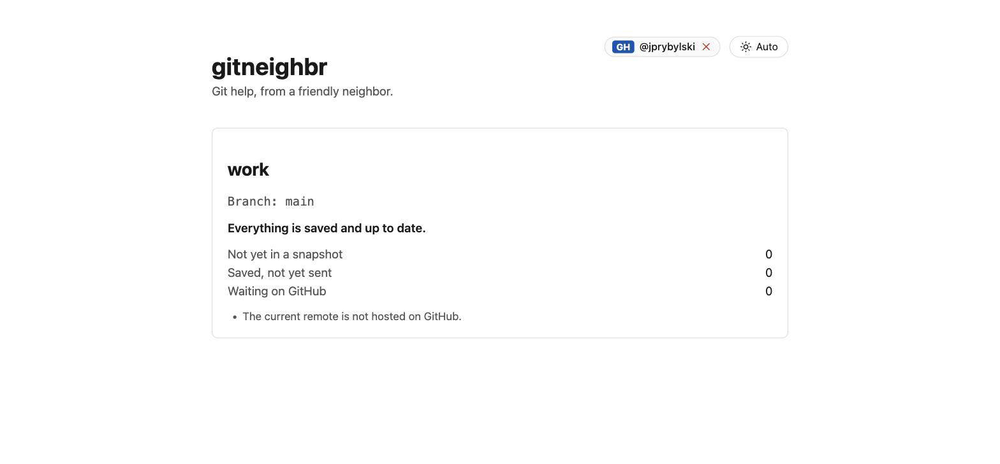
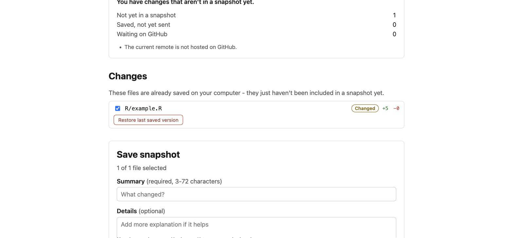
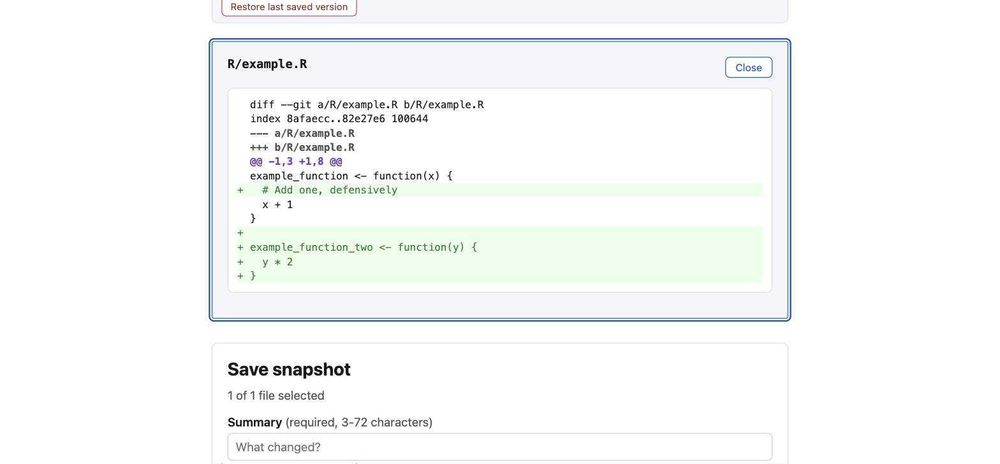
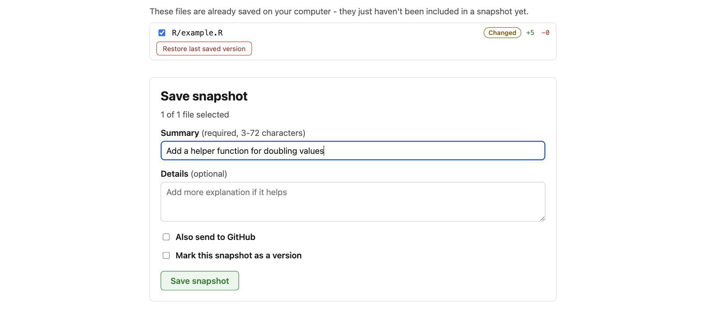

# gitneighbr

<!-- badges: start -->
[](https://github.com/jprybylski/gitneighbr/actions/workflows/R-CMD-check.yaml)
[](https://codecov.io/gh/jprybylski/gitneighbr)
[](https://jprybylski.github.io/gitneighbr/)
<!-- badges: end -->

> **Git help, from a friendly neighbor.**

`gitneighbr` is a local, browser-based R package and application that helps people who are unfamiliar with Git understand, save, and publish changes in a Git repository — while staying a fast, scriptable convenience tool for experienced users too.

It deliberately exposes a small, safe subset of Git (status, commit, push, version tags, single-file restore, and `.gitignore` assistance) and refuses to automate anything requiring human judgment (such as diverged histories or merge conflicts).

## Documentation

Full documentation, including function reference and articles, is available at **[jprybylski.github.io/gitneighbr](https://jprybylski.github.io/gitneighbr/)**:

- [Getting Started](https://jprybylski.github.io/gitneighbr/articles/getting-started.html)
- [The Safety and Security Model](https://jprybylski.github.io/gitneighbr/articles/safety-model.html)

---

## Screenshots

| | |
|---|---|
|  |  |
|  |  |

---

## Features

- **Intuitive Repository Status**: Explains repository state in plain language before offering actions (Clean, Changes Not Yet in a Snapshot, Local Snapshots Ahead, Remote Updates Available).
- **Safe Snapshot Workflow**: Select individual files, write clear summary messages, and save commits without altering unselected work.
- **Push & Pull Safeguards**: Fetch-first safe send to GitHub and fast-forward-only updates to avoid unexpected merge commits.
- **Safe File Management**:
  - Revert a single tracked file's changes since its last snapshot, with explicit confirmation.
  - Remove untracked files by sending them to your operating system's Trash / Recycle Bin (never `git clean`).
  - Add ignore rules to `.gitignore` with single-click rule suggestions.
- **Version Tagging & Releases**: Create annotated semantic version tags and publish GitHub releases.
- **Guided Onboarding**: Initialize a new Git repository or clone an existing GitHub repository from an empty folder.
- **Diagnostic Export & Handoff**: Safely explains diverged branches or conflicts and exports sanitized diagnostic reports for Git experts.
- **GitHub Collaboration**: Support for GitHub Personal Access Tokens (PAT), branch creation, and Pull Request generation for protected branches.
- **RStudio / Positron Integration**: Built-in RStudio Addin to open the repository in the Viewer pane or default browser.
- **Light & Dark Theme**: Supports Auto (system preference), Light, and Dark modes.
- **Robust Security**: Bound strictly to `127.0.0.1`, protected by random session bearer tokens, Host header / DNS rebinding validation, Origin checks, and single-mutation mutex locking.

---

## Installation

Install the development version from GitHub:

```r
# install.packages("pak")
pak::pak("jprybylski/gitneighbr")
```

---

## Usage

### Open the Application

```r
library(gitneighbr)

# Open current working directory in browser
session <- open_repo()

# Or specify a target directory
session <- open_repo(path = "~/projects/my-analysis")
```

The server process starts asynchronously in the background; your R console is freed immediately.

### Checking Environment Health

```r
# Run diagnostic checks on Git executable, identity, and credentials
doctor()
```

### Stopping the App

```r
# Stop via session object
session$stop()

# Or stop by port number
stop_session(port = 52200)
```

---

## Architecture & Development

- **Backend**: Local [`plumber2`](https://plumber2.data-imaginist.com/) HTTP server running in an independent background process via `processx`.
- **Git Authoritativeness**: Direct execution of the user's system `git` using argument arrays, preserving credential helpers, SSH keys, GPG signing, and hooks.
- **Frontend**: Svelte 5 + TypeScript single-page application built with [bun](https://bun.sh). The precompiled production build ships committed in `inst/www/`, requiring no Node or build tools during package installation.

### Running Tests

```r
# Run R unit and integration tests (testthat)
devtools::test()

# Full CRAN package check
devtools::check(args = c("--as-cran"))
```

### Rebuilding Frontend & Running E2E Tests

```bash
cd frontend
bun install
bun run build
bun run test:e2e
```

---

## License

MIT © John Prybylski
