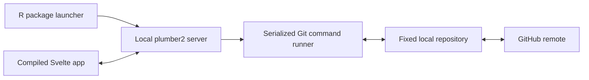

# gitneighbor

## Product and technical specification

**Working tagline:** Git help, from a friendly neighbor.  
**Document status:** Proposed specification for the first implementation  
**Target release:** `0.1.0`  
**Primary distribution:** CRAN R package  
**Last updated:** 2026-08-16

---

## 1. Product summary

`gitneighbor` is a local, browser-based application that helps non-technical and occasionally technical users understand, save, and publish changes in an existing Git repository.

The package deliberately exposes a small, safe subset of Git. It translates repository state into plain language, guides the user through the correct next action, and declines to automate situations that require informed technical judgment.

The primary launch experience is:

```r
install.packages("gitneighbor")
gitneighbor::open_repo()
```

This command starts an authenticated server on the local computer, opens the application in the user's default browser, and manages the repository containing the current working directory.

`gitneighbor` is not an IDE integration, a Git teaching interface, a GitHub replacement, or a comprehensive Git client. It is a friendly workflow for the common case:

> See what changed, save a coherent snapshot, optionally label a version, and safely send it to GitHub.

---

## 2. Product goals

Version `0.1.0` must:

1. Explain the current local and remote repository state without requiring Git vocabulary.
2. Let users review changed files and readable text diffs.
3. Let users select files, enter a summary, create a commit, and push it.
4. Optionally create and push one annotated tag with that commit.
5. Safely receive remote changes when a fast-forward update is possible.
6. Offer narrowly scoped cleanup actions for ignored, unwanted, or accidentally changed files.
7. Recognize conflicts, divergence, authentication failures, hooks, protected branches, and other exceptional states without making a risky guess.
8. Use the user's existing Git installation, configuration, hooks, credential helper, SSH setup, signing setup, Git LFS configuration, and remote URLs.
9. Install from CRAN without requiring Node.js, npm, Python, Rust, or a JavaScript build step on the user's computer.
10. Work on current Windows, macOS, and Linux releases supported by R and the package dependencies.

## 3. Non-goals for version 0.1.0

The initial release will not expose:

- Branch creation, switching, deletion, or merging.
- Pull requests, issues, releases, or other GitHub API features.
- Rebasing, cherry-picking, stashing, bisecting, or submodule management.
- Force pushing or tag replacement.
- Hard reset, history rewriting, or bulk repository cleaning.
- Commit amendment.
- Multiple remotes or remote selection in the ordinary interface.
- Repository cloning, initialization, or GitHub repository creation.
- In-browser editing of repository files.
- A visual commit graph.
- Multi-user or remotely hosted operation.
- Background synchronization when the application is closed.

The application may detect these situations and explain them, but it must not expose controls that perform them.

---

## 4. Intended users

### Primary user

An R user, analyst, researcher, writer, educator, or project contributor who works in a Git-backed folder but does not want to reason about Git's index, refs, refspecs, upstream tracking, detached heads, or merge strategies.

### Secondary user

A technical user helping less technical collaborators adopt a safe, standardized repository workflow.

### Assumed environment

- R is installed.
- Git is installed and available on `PATH` or discoverable through an explicit option.
- The folder is already a Git working tree.
- The current branch normally tracks a GitHub remote branch.
- Authentication has been or can be configured through Git Credential Manager, an OS credential helper, SSH, or another mechanism supported by system Git.

---

## 5. Experience principles

### 5.1 Explain state before offering action

Every primary action must be justified by a visible description of the current state. The interface must never present a generic **Sync** button whose effect changes silently according to hidden conditions.

### 5.2 Use user language, with Git language available secondarily

The interface should say **Save a snapshot** before **Commit**, and **Send to GitHub** before **Push**. Git terms may appear in supporting text, tooltips, diagnostics, and an optional advanced-details disclosure.

### 5.3 Prefer safe refusal to opaque recovery

If the local and remote histories have diverged, a merge conflict exists, or Git cannot establish a safe fast-forward, the application must stop and explain what happened. It must not merge, rebase, reset, force push, or discard work automatically.

### 5.4 Make destructive scope explicit

Avoid generic verbs such as **Clean**, **Fix**, and **Undo** when they obscure what will be changed. Prefer:

- **Restore the last saved version of this file**
- **Stop showing this generated file**
- **Remove this new untracked file**

Every destructive action must name its target and show a confirmation step.

### 5.5 Keep the ordinary workflow linear

The primary path should have no more than four conceptual steps:

1. Understand the state.
2. Review changes.
3. Save a snapshot.
4. Send it to GitHub, optionally with a version label.

### 5.6 Preserve an escape hatch

Diagnostic views must provide the exact Git command attempted, its exit status, and sanitized standard error under an **Advanced details** disclosure. Secrets and credential values must never be displayed.

---

## 6. User-facing vocabulary

| Internal Git concept | Primary interface language | Secondary detail |
| --- | --- | --- |
| Working tree | Project folder | Working tree |
| Modified/untracked files | Unsaved changes | Modified or new files |
| Staging area/index | Not presented as a persistent concept | Selected files will be staged during save |
| Commit | Saved snapshot | Git commit |
| Push | Send to GitHub | Push to `origin/<branch>` |
| Fetch | Check GitHub for updates | Fetch remote references |
| Fast-forward pull | Get GitHub changes | Fast-forward current branch |
| Ahead | Saved updates waiting to be sent | Local branch is N commits ahead |
| Behind | GitHub has newer updates | Local branch is N commits behind |
| Diverged | Local and GitHub work need help to combine | Branch histories have diverged |
| Tag | Version label | Annotated Git tag |
| Restore | Restore last saved version | `git restore` |
| Ignore | Stop showing this kind of file | Add path or pattern to `.gitignore` |
| Conflict | Changes need help to combine | Merge conflict |

The application must not call a commit a “save” without the qualifier “snapshot” in explanatory copy, because saving a file and committing it are distinct operations.

---

## 7. Repository state model

The backend must reduce Git state to exactly one primary state and zero or more supporting notices.

### 7.1 Primary states

| State ID | User-facing heading | Primary action |
| --- | --- | --- |
| `READY` | Everything is safely on GitHub | None |
| `CHANGES_ONLY` | You have changes that are not in a saved snapshot | Review and save |
| `LOCAL_ONLY` | You have saved snapshots waiting to be sent | Send to GitHub |
| `CHANGES_AND_LOCAL` | You have unsaved changes and saved snapshots waiting to be sent | Review and save, then send |
| `REMOTE_ONLY_CLEAN` | GitHub has newer work | Get GitHub changes |
| `REMOTE_ONLY_DIRTY` | GitHub has newer work, and this folder also has changes | Save or restore local changes first |
| `DIVERGED` | Local work and GitHub work need help to combine | Show intervention guidance |
| `CONFLICTED` | Some files contain changes that need help to combine | Show conflicted files and intervention guidance |
| `AUTH_REQUIRED` | GitHub could not verify your access | Show authentication guidance and retry |
| `NO_UPSTREAM` | This branch is not connected to a GitHub branch | Show technical intervention guidance |
| `DETACHED_HEAD` | This folder is viewing a saved point rather than a working branch | Show technical intervention guidance |
| `NOT_REPOSITORY` | This folder is not a Git repository | Stop; cloning and initialization are out of scope |
| `UNSUPPORTED_REPOSITORY` | This repository uses a setup gitneighbor cannot safely manage | Explain the detected condition |
| `GIT_UNAVAILABLE` | Git could not be found | Show installation/configuration guidance |

### 7.2 Supporting notices

Notices may include:

- Untracked files are present.
- Ignored files are present, if the user opts to show them.
- A commit hook will run when saving.
- Commit signing is enabled.
- Git LFS is active.
- The repository contains a submodule.
- The current remote is not hosted on GitHub.
- A tag exists locally but not remotely.
- A pushed tag exists for the current commit.
- The working tree changed since the last displayed status.

### 7.3 Refresh behavior

- Refresh status after every mutating operation.
- Poll `GET /api/status` every 2 seconds while the page is visible and no operation is running.
- Pause polling while the document is hidden.
- Coalesce repeated requests so only one status calculation runs at a time.
- Include a monotonically increasing `status_version` in every response.
- Require mutating requests to include the last observed `status_version`.
- Reject stale mutations with `409 STATE_CHANGED` and return fresh status.

---

## 8. Primary workflows

### 8.1 Open a repository

1. The user runs `gitneighbor::open_repo(path = ".")`.
2. The launcher resolves the enclosing Git worktree root.
3. The launcher verifies system Git and a supported Git version.
4. The launcher starts a local server on an available port.
5. The launcher generates a cryptographically random session token.
6. The default browser opens the application.
7. The dashboard displays repository name, current branch, GitHub destination, and primary state.

### 8.2 Save a snapshot

1. The user opens **Review changes**.
2. All eligible changed files are selected by default.
3. The user can deselect files.
4. Selecting a text file opens a readable unified diff.
5. Binary files show metadata rather than a text diff.
6. The user enters a required summary between 3 and 72 Unicode characters.
7. An optional details field accepts longer explanatory text.
8. The user selects **Save snapshot**.
9. The server verifies that repository state has not changed.
10. The server stages exactly the selected paths and creates one commit.
11. Hooks and signing behavior configured in Git run normally.
12. The interface displays the new snapshot identifier and refreshes status.

Files already staged before `gitneighbor` starts are treated as changed files, but `gitneighbor` must construct the final staged set explicitly from the user's current selection. It must not accidentally include a previously staged path that the user deselected.

### 8.3 Send saved snapshots to GitHub

1. The server runs a fetch before deciding whether a push is safe.
2. If the remote is ahead or histories diverged, the push does not run.
3. If the local branch can be pushed normally, the interface shows the destination and number of snapshots.
4. The user selects **Send to GitHub**.
5. The server pushes only the current branch to its configured upstream.
6. The interface confirms the remote branch and resulting commit identifier.

### 8.4 Save and send in one guided flow

The interface may combine the preceding operations into **Save and send**. Internally these remain separate operations with a status refresh between them. If saving succeeds and sending fails, the interface must accurately report that the snapshot is safe locally but has not reached GitHub.

### 8.5 Add an optional version label

1. The save/send review includes an off-by-default **Mark this snapshot as a version** switch.
2. Enabling it reveals a tag name and optional annotation.
3. The default suggestion is derived from the most recent semantic-version tag when that derivation is unambiguous.
4. Version `0.1.0` supports annotated tags only.
5. The tag is created only after the commit succeeds.
6. The branch is pushed before the tag.
7. The tag is pushed explicitly as `refs/tags/<name>`.
8. If branch push succeeds and tag push fails, the interface reports the partial result precisely and offers **Retry sending version label**.

Tag names must pass `git check-ref-format --allow-onelevel refs/tags/<name>`. Existing tags are never moved or overwritten.

### 8.6 Get changes from GitHub

1. The server fetches the upstream remote.
2. This action is offered only when the current branch is behind, not ahead, and not diverged.
3. The working tree must be clean.
4. The server performs a fast-forward-only update.
5. If fast-forward is not possible, the operation stops without modifying local history.

### 8.7 Restore a tracked file

1. The user opens a changed tracked file.
2. The interface shows **Restore last saved version**.
3. Confirmation names the file and states that its current unsaved contents will be lost.
4. The server verifies state freshness and restores only that path.
5. Directory-wide restore is not supported in version `0.1.0`.

### 8.8 Remove an untracked file

`gitneighbor` must not use `git clean`. If removal is supported, it must target one explicitly named untracked file and use an OS trash/recycle-bin mechanism where available. If a dependable recoverable deletion mechanism is unavailable, the interface explains how to remove the file manually rather than deleting it permanently.

### 8.9 Ignore an unwanted path

1. The user selects an untracked path and chooses **Stop showing this file**.
2. The default rule is the repository-relative literal path, escaped correctly for `.gitignore`.
3. The exact proposed rule is displayed before writing.
4. Existing `.gitignore` formatting is preserved.
5. Duplicate effective rules are not added.
6. The resulting `.gitignore` change appears as an ordinary change that can be included in the next snapshot.

---

## 9. Interface specification

### 9.1 Application shell

The interface consists of:

- A compact header containing the project name and current branch.
- A primary status card containing one state explanation and one recommended action.
- A changes section.
- A saved snapshots section when the branch is ahead.
- A GitHub section showing the configured destination and update state.
- An optional advanced-details drawer.

The interface must remain useful at a viewport width of 360 pixels and must not require an IDE viewer pane.

### 9.2 Status card examples

**Clean**

> Everything is safely on GitHub. There are no unsaved changes in this folder.

**Changed**

> Three files have changed since your last saved snapshot. Review them before saving.

**Ahead**

> Two saved snapshots are on this computer but not yet on GitHub.

**Remote ahead**

> GitHub has two newer snapshots. Get those updates before sending more work.

**Diverged**

> This computer and GitHub both have work the other does not. Combining them requires a person to choose how the changes fit together. Nothing has been changed by gitneighbor.

### 9.3 Changed-file list

Each row shows:

- Selection checkbox.
- Repository-relative path.
- Friendly state: New, Changed, Renamed, or Deleted.
- Added/deleted line counts when meaningful.
- Binary or large-file indicator.
- Restore, ignore, or removal action when applicable.

Renames are presented as `old/path → new/path`. Paths must be treated as opaque Unicode strings and never parsed on whitespace.

### 9.4 Diff viewer

- Render unified text diffs with additions, deletions, and context.
- Preserve tabs and significant whitespace.
- Provide an accessible non-color indicator for additions and deletions.
- Limit the initial response by bytes and lines.
- Offer chunked loading for larger diffs.
- Do not attempt semantic notebook diffing in version `0.1.0`.
- Never render file content as trusted HTML.

### 9.5 Commit form

- Summary is required.
- Details are optional.
- The primary button states exactly what will happen: **Save snapshot** or **Save and send**.
- The selected file count appears beside the button.
- Empty commits are not supported.
- The form remains populated if Git rejects the commit.

### 9.6 Accessibility

- Meet WCAG 2.2 AA for the application-controlled interface.
- All operations must be keyboard accessible.
- Status changes use an appropriate ARIA live region.
- Focus moves to the result or error summary after an operation.
- Color is never the sole carrier of meaning.
- Destructive confirmation dialogs trap focus and support Escape to cancel.
- Respect reduced-motion preferences.

---

## 10. System architecture



### 10.1 Runtime components

1. **Launcher:** exported R functions that resolve the repository, create the session, start the server, and open the browser.
2. **Server:** a `plumber2` application serving JSON endpoints and static assets.
3. **Git adapter:** internal R functions invoking system Git through `processx` without a shell.
4. **State interpreter:** converts porcelain output and command results into the product state model.
5. **Frontend:** a statically compiled Svelte single-page application.

### 10.2 Chosen technology

| Layer | Choice |
| --- | --- |
| R version | R 4.2 or later |
| Web server | `plumber2` 0.2.0 or later |
| Child process lifecycle | `callr` 3.8.0 or later |
| External command execution | `processx` |
| JSON | `jsonlite` |
| Paths | `fs` |
| Frontend | Svelte with TypeScript |
| Frontend build | Vite |
| Git engine | System Git 2.34 or later |
| Browser launch | `utils::browseURL()` with IDE-aware translation where required |
| Unit testing | `testthat` edition 3 |
| Browser testing | Playwright, development-only |

Node.js, npm, Svelte, Vite, and Playwright are development dependencies only. The CRAN source and binary packages ship precompiled static assets.

### 10.3 Why system Git is authoritative

Using system Git preserves behavior for:

- Git Credential Manager and platform credential helpers.
- SSH agents and SSH configuration.
- Commit hooks.
- Commit and tag signing.
- Git LFS and clean/smudge filters.
- Global, system, and repository Git configuration.
- Repository extensions understood by the installed Git version.

The package must not invoke Git through shell-constructed command strings. It uses executable and argument arrays, with the repository passed as the process working directory.

---

## 11. R package interface

### 11.1 Exported functions

```r
open_repo(
  path = ".",
  browse = interactive(),
  host = "127.0.0.1",
  port = 0L,
  git = getOption("gitneighbor.git", Sys.which("git"))
)
```

Starts a `gitneighbor` session and invisibly returns a `gitneighbor_session` object.

```r
doctor(
  path = ".",
  git = getOption("gitneighbor.git", Sys.which("git"))
)
```

Returns a structured diagnostic report without starting a server or mutating the repository.

```r
stop_session(session = NULL)
```

Stops the supplied session or the most recently started live session.

```r
session_url(session = NULL)
```

Returns a redacted browser URL that omits the authentication token. Intended for diagnostics; opening a new authenticated browser is handled by an internal method.

### 11.2 Session object

The returned R6 or S3 session object provides:

- `is_alive()`
- `browse()`
- `stop()`
- `url(redact = TRUE)`
- `repo_path()`
- `logs(tail = 100L)`

Printing the object must never reveal the session token.

### 11.3 Options

| Option | Purpose |
| --- | --- |
| `gitneighbor.git` | Explicit Git executable path |
| `gitneighbor.browser` | Browser function compatible with `browseURL` |
| `gitneighbor.log_level` | `error`, `warn`, `info`, or `debug` |
| `gitneighbor.diff_max_bytes` | Initial diff response limit |
| `gitneighbor.poll_seconds` | Frontend polling interval, minimum 1 second |

There is no option to enable force push or other excluded operations.

---

## 12. Local server lifecycle and security

### 12.1 Binding and port

- Bind to `127.0.0.1` by default.
- Reject `host = "0.0.0.0"` and non-loopback hosts in version `0.1.0`.
- Use port `0` to request an available port.
- Validate the `Host` header against the chosen loopback host and port to mitigate DNS-rebinding attacks.

### 12.2 Session authentication

- Generate at least 256 bits of randomness for every session token.
- Put the initial token in the URL fragment, not the query string.
- The Svelte client reads the fragment into memory, removes it from browser history, and sends it as a bearer token with every API request.
- Tokens are never written to package logs or displayed by session printing.
- Reject requests without the correct token using a uniform `401` response.
- Do not enable CORS.
- Validate `Origin` on mutating requests.

### 12.3 Repository confinement

- Resolve and canonicalize the repository root once at launch.
- The API accepts repository-relative paths only.
- Reject absolute paths, parent traversal, NUL bytes, and paths that resolve outside the repository.
- Do not allow the client to switch repositories within a session.
- Do not expose arbitrary file-read or command-execution endpoints.

### 12.4 Process lifecycle

- Run the server in a background R process managed by `callr`.
- Capture stdout and stderr to a session-specific temporary log.
- Stop the server when explicitly requested.
- Use `callr` supervision so abandoned child processes are cleaned up when feasible.
- Remove token and transient session files on shutdown.

### 12.5 Operation serialization

- Permit multiple concurrent read requests.
- Permit only one repository-mutating operation at a time.
- Return `423 OPERATION_IN_PROGRESS` for a competing mutation.
- Every mutation receives an operation ID used in logs and the response.

---

## 13. Git command policy

### 13.1 Allowed read commands

The implementation may use narrowly constrained forms of:

- `git --version`
- `git rev-parse`
- `git status --porcelain=v2 -z --branch`
- `git diff`
- `git diff --cached`
- `git log`
- `git show`
- `git remote get-url`
- `git config --get`
- `git check-ref-format`
- `git tag --list`
- `git ls-remote`
- `git rev-list --left-right --count`

Status and path parsing must use NUL-delimited porcelain output wherever available.

### 13.2 Allowed mutating commands

Only the following operations are permitted in version `0.1.0`:

- `git fetch <upstream-remote>`
- Explicit index reconstruction for selected paths.
- `git add -- <selected paths>`
- `git commit` with a message file.
- `git push <remote> <local-branch>:<remote-branch>` without force flags.
- `git merge --ff-only <upstream-ref>` or an equivalent verified fast-forward.
- `git tag -a <tag> -F <message-file>`
- `git push <remote> refs/tags/<tag>:refs/tags/<tag>`
- `git restore --worktree -- <single tracked path>`

Commit and tag messages must be passed using secure temporary files rather than interpolated command-line strings.

### 13.3 Forbidden commands and flags

The package must never execute:

- `git push --force`, `--force-with-lease`, or `+` refspecs.
- `git reset --hard`.
- `git clean`.
- `git rebase`.
- `git merge` without `--ff-only`.
- `git checkout` for branch switching or path restoration.
- `git stash`.
- `git commit --amend`.
- Tag deletion, replacement, or forced tag pushes.
- Shell commands constructed from repository paths or user input.

### 13.4 Staging invariants

The index is a real part of the repository even though the interface hides it. To avoid surprising users:

1. Capture the complete pre-operation index state.
2. Build the desired staged set corresponding exactly to the user's selection.
3. If commit creation fails before Git itself commits, restore the previous index state when this can be done without touching working-tree content.
4. Never discard working-tree content while manipulating the index.
5. Test repositories with partially staged files, intent-to-add entries, renames, deletions, and filenames containing spaces or Unicode.

Version `0.1.0` supports selection at file granularity, not hunk or line granularity.

---

## 14. HTTP API

All API responses use JSON with this envelope:

```json
{
  "ok": true,
  "data": {},
  "error": null,
  "status_version": 17
}
```

Errors use:

```json
{
  "ok": false,
  "data": null,
  "error": {
    "code": "REMOTE_AHEAD",
    "title": "GitHub has newer work",
    "message": "Get those updates before sending your saved snapshots.",
    "recoverable": true,
    "advanced": {
      "command": "git push …",
      "exit_status": 1,
      "stderr": "sanitized output"
    }
  },
  "status_version": 18
}
```

### 14.1 Endpoints

| Method | Path | Purpose |
| --- | --- | --- |
| `GET` | `/api/v1/health` | Server readiness and package version |
| `GET` | `/api/v1/status` | Complete interpreted repository state |
| `GET` | `/api/v1/changes` | Changed-file metadata |
| `GET` | `/api/v1/diff` | Diff for one repository-relative path |
| `GET` | `/api/v1/history` | Limited recent snapshot list |
| `GET` | `/api/v1/tags` | Relevant local and remote tag information |
| `POST` | `/api/v1/refresh-remote` | Fetch and return updated state |
| `POST` | `/api/v1/commit` | Commit selected paths |
| `POST` | `/api/v1/push` | Push the current branch |
| `POST` | `/api/v1/update` | Apply a verified fast-forward-only update |
| `POST` | `/api/v1/tag` | Create an annotated tag on current `HEAD` |
| `POST` | `/api/v1/push-tag` | Push one exact local tag |
| `POST` | `/api/v1/restore` | Restore one tracked path |
| `POST` | `/api/v1/ignore` | Append one confirmed `.gitignore` rule |
| `POST` | `/api/v1/shutdown` | Stop this session |

Combined **Save and send** behavior is frontend orchestration over `/commit`, status refresh, `/push`, and optional tag endpoints. It is not one opaque backend transaction.

### 14.2 Status response essentials

`GET /api/v1/status` returns at least:

```json
{
  "repository": {
    "name": "example",
    "root_display": "~/projects/example",
    "branch": "main",
    "detached": false
  },
  "upstream": {
    "remote": "origin",
    "branch": "main",
    "host": "github.com",
    "display_url": "github.com/owner/example",
    "ahead": 1,
    "behind": 0,
    "diverged": false
  },
  "working_tree": {
    "clean": false,
    "changed_count": 2,
    "untracked_count": 1,
    "conflicted_count": 0
  },
  "primary_state": {
    "id": "CHANGES_AND_LOCAL",
    "heading": "You have unsaved changes and a saved snapshot waiting to be sent",
    "recommended_action": "REVIEW_AND_SAVE"
  },
  "capabilities": {
    "can_commit": true,
    "can_push": true,
    "can_update": false,
    "can_tag": true
  },
  "status_version": 17
}
```

Do not return the canonical absolute repository root to the browser unless required for an explicitly approved diagnostic view. Prefer a home-relative display path.

---

## 15. Error taxonomy

The backend must map raw Git failures to stable application codes where possible.

| Code | Meaning |
| --- | --- |
| `GIT_UNAVAILABLE` | Git executable cannot be found or run |
| `GIT_TOO_OLD` | Installed Git version is unsupported |
| `NOT_REPOSITORY` | Path is not inside a working tree |
| `BARE_REPOSITORY` | Repository has no working tree |
| `DETACHED_HEAD` | `HEAD` is detached |
| `NO_UPSTREAM` | Current branch has no upstream |
| `REMOTE_NOT_GITHUB` | Remote is not recognized as GitHub; advisory by default |
| `AUTH_REQUIRED` | Authentication was rejected or unavailable |
| `REMOTE_UNREACHABLE` | Network, DNS, or remote availability failure |
| `REMOTE_AHEAD` | Push is blocked because remote contains newer work |
| `DIVERGED` | Local and upstream both contain unique commits |
| `DIRTY_BLOCKS_UPDATE` | Local changes prevent safe update |
| `CONFLICTS_PRESENT` | Repository already contains unresolved conflicts |
| `PROTECTED_BRANCH` | Remote policy rejected the push |
| `HOOK_FAILED` | A configured Git hook rejected the commit or push |
| `SIGNING_FAILED` | Commit or tag signing failed |
| `LARGE_FILE_REJECTED` | Remote rejected file size or LFS policy |
| `TAG_EXISTS` | Requested tag already exists locally or remotely |
| `INVALID_TAG` | Requested tag is not a valid Git ref name |
| `EMPTY_SELECTION` | No files were selected |
| `EMPTY_COMMIT` | Selection produces no staged changes |
| `STATE_CHANGED` | Repository changed after the displayed status |
| `OPERATION_IN_PROGRESS` | Another mutation holds the repository lock |
| `PATH_OUTSIDE_REPOSITORY` | Requested path escapes the fixed repository root |
| `COMMAND_FAILED` | Safe fallback for an unmapped Git failure |

Raw stderr must be sanitized for bearer tokens, embedded URL credentials, home-directory disclosure where unnecessary, and known credential patterns before reaching the browser or logs.

---

## 16. Authentication behavior

`gitneighbor` does not collect, transmit, or store GitHub credentials.

It delegates remote authentication to system Git and therefore supports whatever the installed Git supports, including:

- Git Credential Manager.
- OS-native credential helpers.
- SSH agent and configured SSH keys.
- Credential helpers installed by GitHub CLI.

When authentication fails:

1. Preserve all local work.
2. Report whether the failure occurred during fetch or push.
3. Provide platform-appropriate setup guidance.
4. Offer **Retry** after the user completes authentication externally.
5. Never ask the user to paste a personal access token into the web application.

GitHub OAuth is explicitly deferred beyond version `0.1.0`.

---

## 17. Package structure

```text
gitneighbor/
├── DESCRIPTION
├── LICENSE
├── NAMESPACE
├── NEWS.md
├── README.md
├── R/
│   ├── open-repo.R
│   ├── session.R
│   ├── doctor.R
│   ├── server.R
│   ├── api-status.R
│   ├── api-changes.R
│   ├── api-mutations.R
│   ├── git-runner.R
│   ├── git-status.R
│   ├── git-diff.R
│   ├── git-commit.R
│   ├── git-remote.R
│   ├── git-tag.R
│   ├── state-model.R
│   ├── errors.R
│   └── security.R
├── inst/
│   ├── www/
│   │   ├── index.html
│   │   └── assets/
│   └── licenses/
├── frontend/
│   ├── package.json
│   ├── package-lock.json
│   ├── tsconfig.json
│   ├── vite.config.ts
│   └── src/
├── tools/
│   ├── build-frontend
│   └── check-frontend
├── tests/
│   ├── testthat.R
│   ├── testthat/
│   ├── fixtures/
│   └── integration/
├── vignettes/
│   ├── getting-started.Rmd
│   └── safety-model.Rmd
└── .Rbuildignore
```

### 17.1 CRAN packaging rules

- `inst/www` contains the production frontend build.
- Node modules are never included.
- Package installation and loading do not run npm or contact the network.
- The frontend build is reproducible from the checked-in source and lockfile.
- JavaScript and CSS licenses are recorded under `inst/licenses` as required.
- Generated bundles contain no source-system absolute paths.
- CRAN examples do not open a browser or leave a server process running.
- Network-dependent tests are disabled on CRAN.

---

## 18. Testing specification

### 18.1 Unit tests

Unit tests must cover:

- Porcelain v2 parsing with NUL delimiters.
- Modified, added, deleted, renamed, copied, untracked, ignored, and conflicted paths.
- Spaces, tabs, newlines, leading dashes, Unicode, and platform-specific path behavior.
- Ahead/behind and primary-state derivation.
- Tag validation and semantic-version suggestions.
- GitHub HTTPS and SSH remote URL normalization.
- Error classification and secret sanitization.
- Repository confinement and traversal rejection.
- Stale status-version rejection.

### 18.2 Integration tests

Use temporary working repositories and local bare repositories as remotes. No internet access is required. Cover:

- Clean repository.
- Commit selected files.
- Preserve deselected and pre-staged changes.
- Push a branch.
- Fast-forward update.
- Remote-ahead push rejection.
- Diverged history detection.
- Annotated tag creation and explicit tag push.
- Existing-tag refusal.
- Failed hooks.
- Restore one tracked file.
- Server startup, token enforcement, and shutdown.

### 18.3 Browser tests

Development CI uses Playwright to cover:

- Each primary-state rendering.
- Change selection and diff display.
- Commit form validation.
- Save, push, and optional tag orchestration.
- Partial success after a failed push or tag push.
- Keyboard navigation and focus behavior.
- Narrow viewport layout.
- Session expiry and server shutdown.

Browser tests run against fixture-backed API responses for visual state coverage and against temporary real repositories for critical end-to-end flows.

### 18.4 CRAN checks

- `R CMD check --as-cran` passes on all supported platforms.
- Tests do not require GitHub credentials.
- Tests skip with a clear reason if system Git is unavailable.
- No test binds a public network interface.
- All server processes and temporary repositories are cleaned up, including after failure.

---

## 19. Logging, privacy, and telemetry

- No telemetry in version `0.1.0`.
- No repository contents, diffs, paths, remote URLs, commit messages, or Git output leave the user's computer through `gitneighbor`.
- Logs are local and session-scoped.
- Default logging records operation type, duration, exit status, and application error code—not file content.
- Debug logging is opt-in and still redacts tokens and credentials.
- The application includes a plain-language privacy statement accessible from the footer.

---

## 20. Performance targets

On a repository with 10,000 tracked files and 100 changed files, excluding Git's own execution time variability:

- Initial application shell visible within 1 second after server readiness.
- Normal status API response within 500 milliseconds.
- Cached unchanged status response within 150 milliseconds.
- First 500 lines of a text diff visible within 500 milliseconds.
- User interaction remains responsive while Git operations run.

Status responses must impose limits so repositories with pathological numbers of changed files return a valid summarized state rather than exhausting memory. The default changed-file display limit is 1,000 paths with an explicit truncation notice.

---

## 21. Release acceptance criteria

Version `0.1.0` is ready when all of the following are true:

1. A user can install the package from a local source tarball without Node.js.
2. `open_repo()` launches a token-protected browser application on Windows, macOS, and Linux.
3. The dashboard correctly distinguishes clean, changed, ahead, behind, diverged, conflicted, detached, and unauthenticated states.
4. A user can select files, review diffs, commit, and push without seeing the staging-area concept.
5. A user can optionally create and push one annotated tag.
6. Remote-ahead and diverged states cannot trigger an unsafe push.
7. Remote updates are fast-forward-only and require a clean working tree.
8. No ordinary UI path can force push, rewrite history, or recursively delete untracked files.
9. Existing credentials, hooks, signing, and Git LFS behavior are delegated to system Git.
10. Unit, integration, browser, accessibility, and CRAN checks pass.
11. The safety model and recovery boundaries are documented.
12. A usability test with at least five target users completes the ordinary save-and-send workflow without external Git instruction; observed terminology failures are addressed before release.

---

## 22. Proposed roadmap

### `0.1.0` — Safe core workflow

- Existing repository only.
- Status, changes, file diffs, commit, fetch, fast-forward update, push.
- Optional annotated tag creation and push.
- Single-file restore and `.gitignore` assistance.
- GitHub-oriented copy with system-Git transport.

### `0.2.0` — Onboarding and recovery

- Guided Git identity configuration.
- Credential diagnostics.
- Clone an existing GitHub repository.
- Initialize and publish a new repository.
- Improved conflict handoff with exportable diagnostic report.

### `0.3.0` — Collaboration

- Optional GitHub API integration.
- Protected-branch workflow through a generated branch and pull request.
- Release creation from a pushed tag.
- Repository-specific policy configuration.

### Deferred indefinitely unless user research supports it

- General branch management.
- History rewriting.
- Full merge-conflict editor.
- Arbitrary remote hosting administration.
- IDE embedding as the primary experience.

---

## 23. Brand and voice

The name `gitneighbor` evokes calm, considerate maintenance rather than technical power. The product voice should be:

- Friendly but not cute at the expense of precision.
- Reassuring without claiming that unsent work is backed up.
- Direct when an action is destructive or blocked.
- Free of blame when repository state is complicated.

Suggested phrases:

- **Everything is safely on GitHub.**
- **Let’s review what changed.**
- **This snapshot is saved on your computer but has not reached GitHub yet.**
- **GitHub has newer work. Get it before sending your changes.**
- **These changes need a person to help combine them. gitneighbor has not changed anything.**
- **All set — reviewed, noted, and sent home.**

Avoid:

- “Your branch is clean.”
- “Working tree dirty.”
- “Rejected non-fast-forward.”
- “Just force push.”
- “Something went wrong.”
- Any use of “backed up” before a successful remote push.

---

## 24. Architectural precedents and references

- [`httpgd`](https://cran.r-project.org/package=httpgd) demonstrates a CRAN-distributed R package that launches a token-protected local HTTP/WebSocket server and ships a compiled TypeScript browser client.
- [`httpgd` server interface](https://nx10.dev/httpgd/reference/hgd.html) demonstrates loopback binding, automatic port selection, browser launching, and per-session tokens.
- [`plumber2`](https://cran.r-project.org/package=plumber2) is the selected R server framework.
- [`plumber2` static-file routing](https://plumber2.posit.co/articles/programmatic-usage.html#static-file-routers) supports direct serving of the compiled frontend.
- [`SveltePlots`](https://cran.r-project.org/package=SveltePlots) demonstrates distribution of compiled Svelte functionality in a CRAN package.
- [`callr`](https://callr.r-lib.org/) provides supervised background R processes.
- [`gert`](https://docs.ropensci.org/gert/reference/index.html) is a useful behavioral and testing reference, although system Git remains authoritative for `gitneighbor`.

---

## 25. Final product boundary

`gitneighbor` succeeds by doing less than Git—not by placing a graphical skin over all of Git.

The first release owns the ordinary path and recognizes the dangerous paths. When the repository is in a state where the next action depends on intent, `gitneighbor` explains the state, preserves the work, and asks for knowledgeable help.

